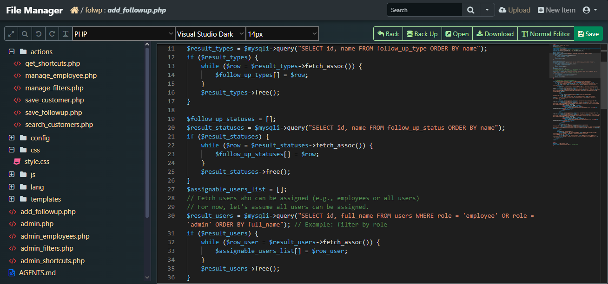

# fm
file.php is a web-based file manager with a VS Code-inspired interface, originally forked from tinyfilemanager.php.

## Screenshot

## Download Folders
Thanks to [@Blaubeeree](https://github.com/Blaubeeree)

## Overwrite Files During Uploading
Thanks to [@uwecmyersjj](https://github.com/uwecmyersjj)
